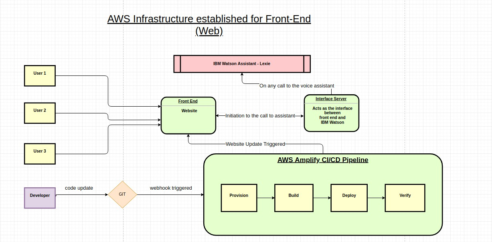
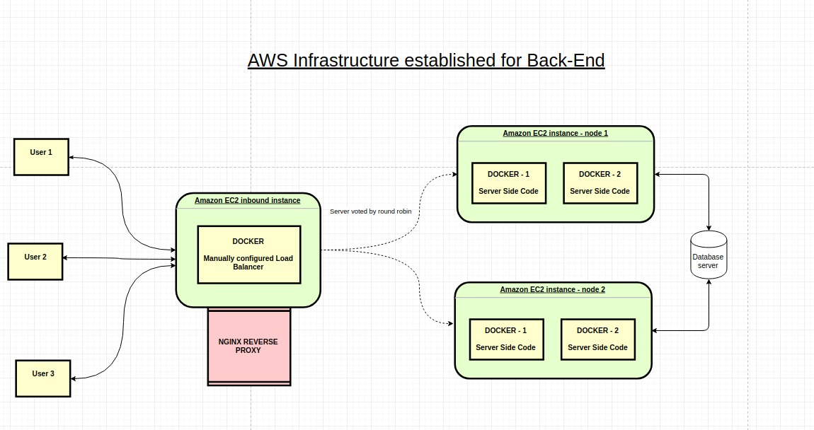

# Evento Project
------------
## Links to the projects:
**Front End (Web)** -- https://github.com/Rish-Singhal/EVENTO-ANGHACK

**Back End (Cloud)** -- https://github.com/yashvardhan-kukreja/angelhack-backend

------------

## Tech Stack Used:
### Frontend (Web):

    - AWS Amplify (CI/CD - Continuous Integration Continuous Deployment)
    - ReactJS
    - HTML/CSS
    - Bootstrap

### Frontend (Android):
    - Java
    - Retrofit (API calls)
    - Realm DB

### Backend (Cloud):

    - AWS EC2 instance (for server deployment)
    - AWS EC2 instance with NGINX (for load balancing)
    - Docker (for containerization of server side code)
    - IBM Watson Assistant 
    - NGINX
    - NodeJS
    - MongoDB
    - ExpressJS
    - MongoDB Atlas
    - MongoDB Compass

------------------

## AWS Infrastructures Implemented:

### Frontend (Web):
 

 

### Backend (Cloud):
 

 

-----------